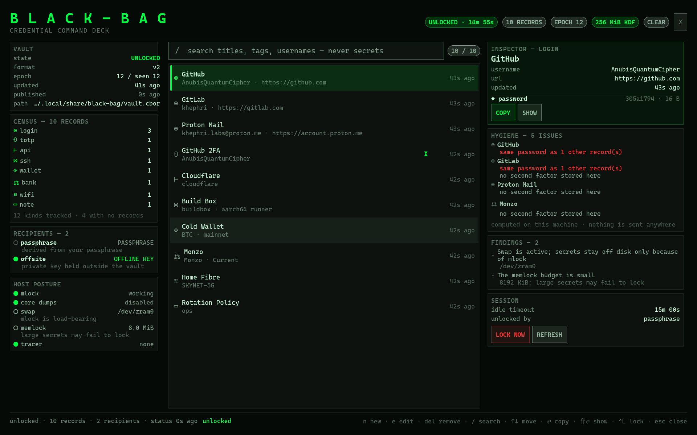
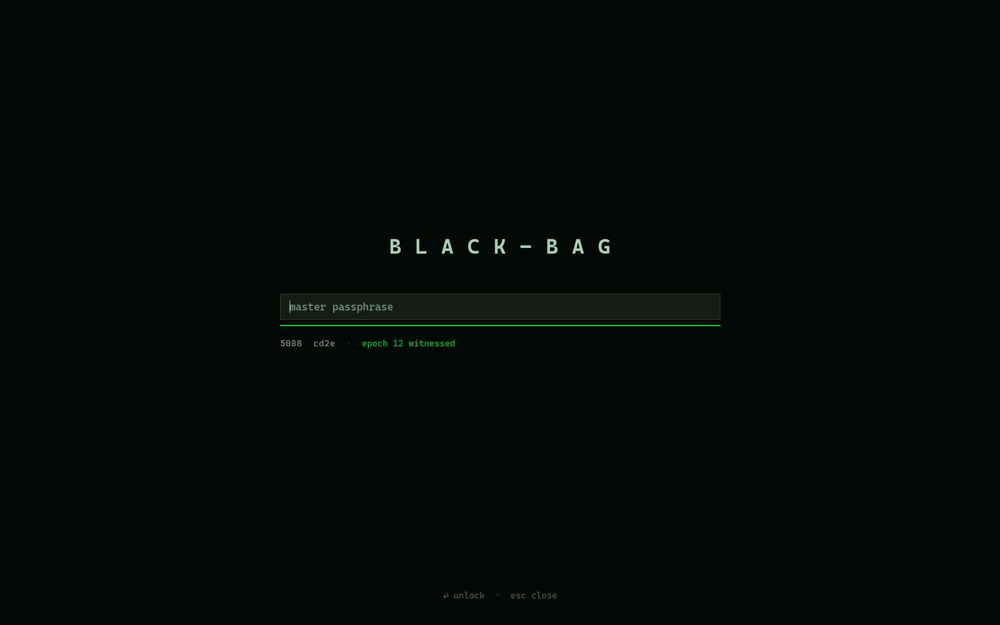
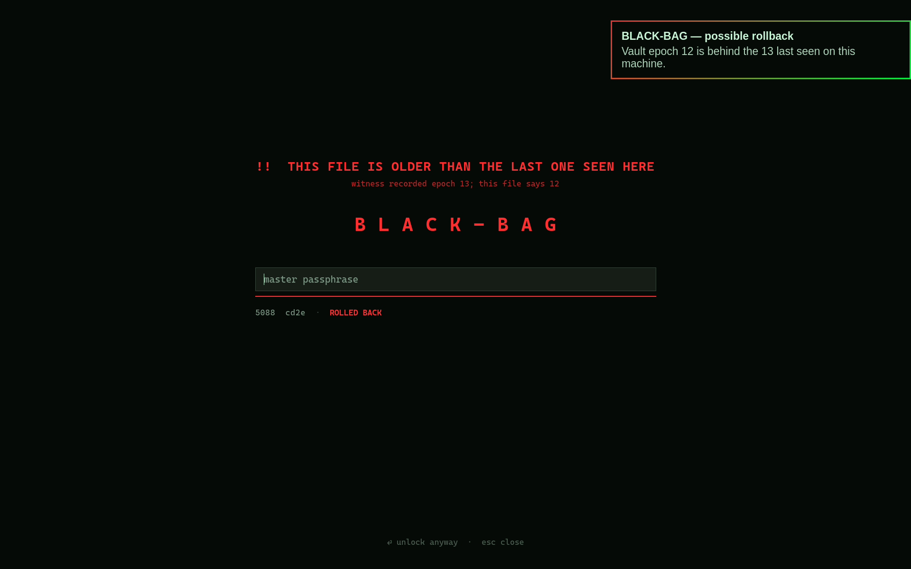
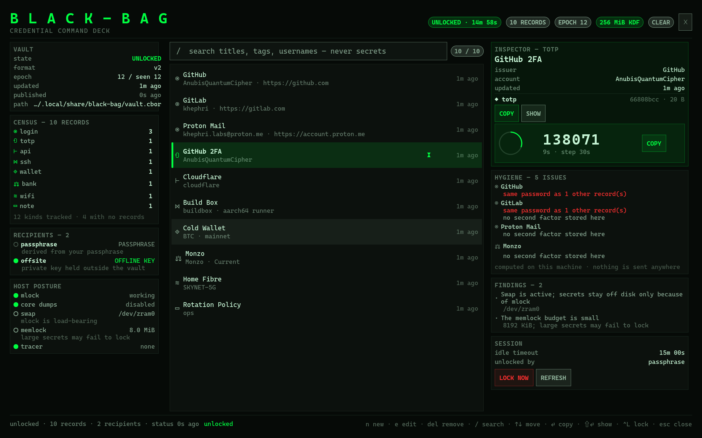
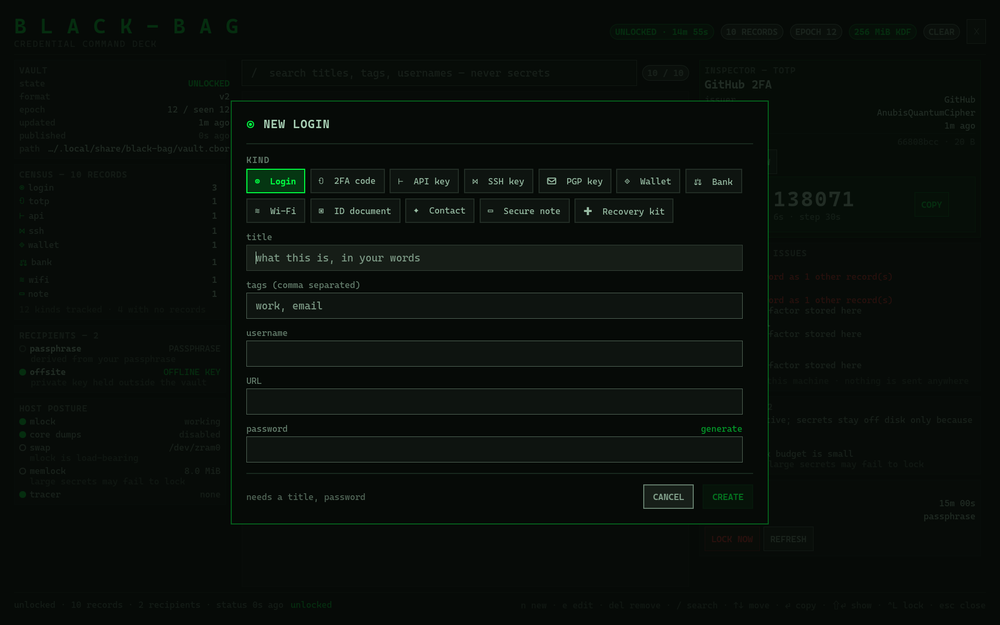
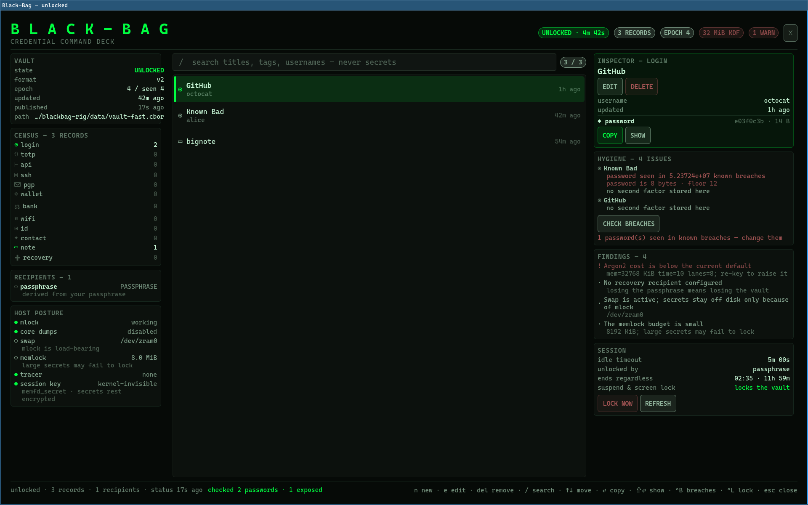
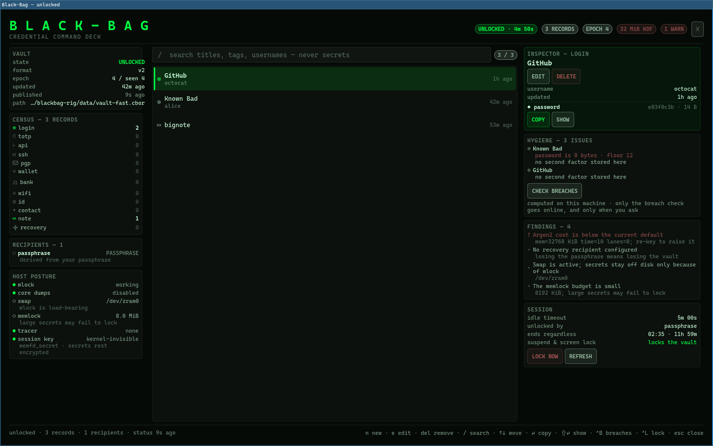

# Black-Bag

Credential storage for Omarchy, with a full-screen command deck.



This is a Linux-only rebuild of the engine behind the [`black-bagg`][crate]
crate, plus two surfaces over it: a Quickshell plugin (`khephri.blackbag`) that
gives Omarchy a bar widget and an in-shell cockpit, and a standalone desktop
application (`blackbag-desktop`) that puts the same deck in a window on any
Wayland or X11 desktop.

The deck is one implementation. `Cockpit.qml`, `Editor.qml` and `Model.js`
belong to it, not to either host; the application's copies are generated from
the plugin's by `desktop/port-from-plugin.py`, and CI fails if they disagree. A
fix lands in both or it lands in neither.

It exists because reading the published crate closely turned up nine findings,
several of them load-bearing. They are written up in **[`docs/AUDIT.md`][audit]**
— including one that needs your hands rather than mine.

[crate]: https://crates.io/crates/black-bagg
[audit]: docs/AUDIT.md

## Documentation

| | |
|---|---|
| [User manual](docs/MANUAL.md) | Install, everyday use, the full keyboard map, the CLI reference, recovery, troubleshooting. |
| [Whitepaper](docs/WHITEPAPER.md) | Threat model, vault format, key hierarchy, the hybrid recipient construction, and a thorough list of what this system does **not** prove. |
| [Audit](docs/AUDIT.md) | The nine findings in the predecessor crate that this rebuild answers. |
| [Changelog](CHANGELOG.md) | What changed, and why. |
| [Security policy](SECURITY.md) | How to report something, and what is in and out of scope. |

If you read one thing before trusting this with a credential, read the
**non-claims** section of the whitepaper.

---

## What it looks like

**Sealed.** Four things at rest: the wordmark, the field, the rule under it, and
one identity line. The fingerprint says which vault this claims to be; the
witness word says whether this machine agrees. Nothing else appears unless there
is a reason.



**A reason.** The two hazards that earn an interruption are a vault older than
the last one seen here, and a debugger attached to the session. A rollback warns
but never blocks — restoring a legitimate backup must not lock you out — so the
verb becomes *unlock anyway*. A debugger blocks completely and offers no
override, because it reads the passphrase keystroke by keystroke and the harm is
finished before Enter.



**Live 2FA**, with the countdown arc that turns red in the last five seconds.
Copying a code copies the *code*, not the stored shared secret.



**Authoring**, because a vault you cannot fill is a viewer. Twelve kinds, each
with the fields it actually needs, a generator on `Ctrl+G`, and `otpauth://`
enrolment that fills in everything from one paste.



Note the **HYGIENE** panel in the first screenshot. GitHub and GitLab there
share a password, and the vault says so — without ever comparing, storing, or
displaying a secret. Every field carries a non-reversible handle, so identical
values collide by construction. It is computed on your machine; nothing is sent
anywhere.

---

## What 2.5.0 changed, and how each item was found

Every one of these came from running the product against itself rather than
reading it. The full account, with the test that pins each, is in
[`CHANGELOG.md`](CHANGELOG.md).

**Every resting secret is ciphertext in memory.** Each record field and the
vault's data key rest sealed under a 32-byte per-process session key. The key
lives in `memfd_secret` memory — removed from the kernel's own direct map,
never swapped, never dumped, never in a hibernation image — with a locked page
as the fallback, and the deck says which you got. Plaintext exists only while a
field is in use, in a locked arena, and is wiped when the use ends. A test reads
`/proc/self/mem` across every writable mapping and asserts a resting secret is
found nowhere. Page-locking every secret was the old design; it had a hole
(`mlock` is page-granular and not reference-counted, so a neighbour's drop
unlocked your page), and it fought an 8 MiB budget the new design does not need.

**The clipboard tells the truth.** The old `wl-copy` path never cleared — the
thread that was going to kill it died with the command — and it offered no
sensitive hint, so Omarchy's own clipboard history recorded every password in a
plaintext file. Copies are now served by a detached, memory-locked helper that
offers `x-kde-passwordManagerHint` beside the text, clears on time only if the
selection is still ours, and does not say "copied" until the compositor has been
seen offering the value.

**The vault seals with the machine.** Suspend and `loginctl lock-session` lock
it through a hand-written minimal D-Bus subscription to logind; Omarchy's own
screen lock locks it through the shell's lock service. A hard session ceiling
(12 h by default) ends an unlock however busy it was. A silent socket connection
can no longer stall the agent.

**Breach checks that keep the hash at home.** `agent breach --online`, or the
deck's two-step CHECK BREACHES, sends five-character SHA-1 prefixes to Pwned
Passwords by k-anonymity, fetches the buckets with `curl`, and matches inside
the agent — which has no network access at all. Exposures fold into the hygiene
report until lock.

**Import and export.** Bitwarden, KeePassXC, Firefox, Chrome and any CSV in;
JSON or KeePassXC CSV out, plaintext by declaration and 0600 by construction.
The JSON export imports back whole, so a backup is restorable.

**A way back in that does not need a terminal.** The deck could mint a
recovery key in first run and had no way to use one — so an owner who only
opens the app was locked out of their own vault while holding the thing that
opens it. `Ctrl+K` on the sealed screen now takes the key file and a new
passphrase, re-keys the vault, and lets you straight in. The offer appears
only when the vault actually has a recovery recipient.



---

## What is different from `black-bagg` 0.4.10

**Post-quantum protection that actually protects something.** 0.4.x generated an
ML-KEM keypair, encapsulated to its own public key, and stored the decapsulation
key in the same file under the same passphrase — so the KEM contributed nothing.
Here, recovery recipients are a hybrid of X25519 and ML-KEM-1024 whose private
half is written to a key file you keep offline and is **never stored in the
vault**. That key opens the vault without the passphrase, and revoking it takes
one command.

**Rotation that rotates.** `black-bag rekey` mints a new data key, re-encrypts
the payload under it, re-wraps every recipient, and can change your passphrase in
the same step. 0.4.x's `rotate` re-wrapped the *same* data key and could not
change the passphrase at all.

**An authenticated header.** The epoch, the Argon2 parameters, and every
recipient descriptor are covered by an HMAC keyed from the data key. Editing any
of them is detected at unlock.

**An anti-rollback epoch.** Every write bumps a counter, and the highest counter
seen is recorded outside the vault. Restoring an old file is noticed. This is a
tripwire, not a guarantee — an attacker who can rewrite the vault can usually
rewrite the witness too — and the cockpit says so.

**Hardening restored from the 0.2.x line**, which the 0.4.x rewrite dropped:
core dumps disabled, `PR_SET_DUMPABLE` cleared, tracer detection, pre- and
post-parse size caps, payload padding so the file size stops leaking how much you
store, secrets written to `/dev/tty` rather than stdout, and Argon2id back to
time=10 / lanes≥4 from 0.4.x's time=3 / lanes=1.

**`panic = "unwind"`.** 0.4.x used `panic = "abort"`, which turns any panic into
SIGABRT with no unwinding — so `Zeroizing` destructors never run and, with core
dumps enabled, secrets land in the dump.

**The mlock bug is fixed.** 0.4.x zeroized a `Vec` and then tried to `munlock` it
using its now-zero length, so the unlock never happened. There is a regression
test that clears the buffer first and asserts the page is still released.

---

## Install

```bash
git clone <this repo> ~/Projects/blackbag
cd ~/Projects/blackbag
cargo build --release
install -Dm755 target/release/black-bag ~/.local/bin/black-bag

# the Omarchy plugin: bar widget + in-shell cockpit
cp -r plugin/khephri.blackbag ~/.config/omarchy/plugins/
~/.config/omarchy/plugins/khephri.blackbag/install.sh

# the standalone desktop application (needs Qt 6.5+ and CMake 3.21+)
desktop/install.sh
```

The plugin installer adds the bar widget, binds `SUPER+SHIFT+K`, writes a
hardened systemd user unit for the unlock agent, and rescans the shell. The
desktop installer builds with CMake and installs the binary, a desktop entry,
a scalable icon and AppStream metadata under `~/.local` — no root, no system
directories.

Both are optional and neither needs the other. The engine is a complete
password manager on its own; the agent is what lets all three share one
unlocked vault.

### The desktop application



Same deck, same rules, its own window and its own settings file. It is a
renderer and a process driver: it holds no key material, performs no
cryptography, and never opens the vault file — it drives `black-bag` as a child
process so plaintext stays out of a long-lived GUI's address space. See
**[`desktop/README.md`](desktop/README.md)**.

---

## Use

```bash
black-bag init                       # create a vault (Argon2id, 256 MiB default)
black-bag recovery add offsite --out ~/recovery.key   # do this before you need it

black-bag add login --title GitHub --attr username=octocat
black-bag list
black-bag get <uuid> --reveal password --to clipboard

black-bag doctor                     # vault + host posture, including where the session key lives
black-bag rekey --change-passphrase

black-bag agent breach --online      # k-anonymity check against Pwned Passwords
black-bag import --from bitwarden.json --format bitwarden --dry-run
black-bag export --to out.csv --format keepassxc --plaintext-ok
```

Coming from `black-bagg`:

```bash
black-bag migrate --from ~/.config/black_bag/vault.cbor --to ~/.local/share/black-bag/vault.cbor
```

There is deliberately **no `--passphrase` flag**. Passphrases are read from the
terminal, or from stdin when there is no terminal — never from `argv`, because
`/proc/<pid>/cmdline` is world-readable.

---

## Authoring

The deck fills its own vault — there is no step where you have to drop to the
CLI. `n` opens the editor, `e` edits the selected record, `Delete` removes one
(twice, deliberately).

Twelve kinds, each with the fields it actually needs: logins, 2FA codes, API
keys, SSH and PGP keys, wallets, bank details, Wi-Fi, ID documents, contacts
with several numbers and addresses, secure notes, and recovery kits.

- **`Ctrl+G` generates** into the focused field, and reports honest entropy.
  The figure is `log2(charset^length)` corrected for the class-presence
  requirement, and it is quoted for **generated values only**. There is
  deliberately no function that takes a typed string and returns bits, because
  that number would be a guess wearing a measurement's clothes.
- **`otpauth://` paste** sets up 2FA in one field — secret, issuer, account,
  digits, period and algorithm all come from the URI. A bare base32 secret works
  too, and spaces, hyphens and case are all tolerated.
- **Editing never loads a secret.** A blank secret box means "keep what is
  stored", so the form can exist without the cockpit ever holding your password.

## Credential hygiene

Computed on this machine, with one declared exception: the breach check, which
runs only when you ask, sends only five-character hash prefixes, and runs from
the CLI through `curl` — the agent process cannot open a network socket.

The interesting one is **reuse detection**. Every secret field carries a
non-reversible 8-character BLAKE3 handle, domain-separated by field name, so two
records holding the same password produce the same handle — and the vault can
tell you they match **without ever comparing, storing or displaying a secret**.
It also flags short passphrases, all-numeric secrets that are too short to be
worth their length, staleness, duplicate titles, and logins with no second
factor stored alongside them.

Honest limits, all of which are in the module docs:

- A handle match means *these share a handle*, not *these are provably
  identical* — 32 bits, so collisions exist.
- Absence of a reuse cluster is not absence of reuse: the domain is the field
  name verbatim, so a `password` and a `passphrase` holding the same value do
  not cluster.
- Staleness is a lower bound. The vault stores no per-field change time, so a
  record touched to fix a tag reports as fresh.
- "No second factor" means *not stored in this vault*, never *this account
  lacks 2FA*.
- The report carries handles and titles, so it is as sensitive as the open
  vault. It travels over the agent socket only and is **never** written to
  `status.json`.

## The cockpit

`SUPER+SHIFT+K`, or click the lock in the bar.

- **Left rail** — vault state, format, epoch against the witness, a twelve-kind
  census, recipients (marked by whether their private key is held offline), and
  host posture: mlock, core dumps, swap, memlock budget, tracer, and where the
  session key lives.
- **Centre** — the unlock panel when sealed; a searchable record table when open.
  Search covers titles, tags, and usernames, and by construction cannot reach
  secrets.
- **Right rail** — inspector for the selected record, hygiene worst-first with
  the two-step breach check, findings, and the session: idle timeout, the hour
  the session ends regardless, why it last locked, and whether suspend and the
  screen lock are being watched. TOTP codes come with a countdown arc that turns
  red in the last five seconds.

Keys: `n` new · `e` edit · `Del` remove · `/` search · `↑↓` move · `⏎` copy ·
`⇧⏎` show · `^B` breaches · `^L` lock · `Esc` close. In the editor: `Tab` moves
· `^G` generates · `^⏎` saves · `Esc` cancels. Every button takes `Tab` focus
and answers `Space` or `Enter`.

### Where secrets are, and are not

| Surface | Holds a secret? |
|---|---|
| `status.json` in `$XDG_RUNTIME_DIR` | **Never.** No titles, tags, counts, or values — only posture, parameters, recipient labels, and lock state. There is a test that asserts this. |
| Bar widget | Never. Reads only `status.json`. |
| Cockpit | Only during an explicit `SHOW`, on a visible countdown, then cleared. `COPY` goes straight to the clipboard and never renders. |
| Agent | Holds the data key and every record sealed under a session key that lives in `memfd_secret` memory, behind a `0600` socket in a `0700` directory, with `SO_PEERCRED` checked and a 3-second budget on every connection. |
| Clipboard | For the configured interval (30 s default), offered with the sensitive hint so clipboard managers skip it, then cleared — unless something else has been copied since, which is left alone. |

The record *metadata* the cockpit shows arrives over the agent socket and lives
in the shell's memory, never on disk. Secret fields are shown as a name, a size,
and an 8-character non-reversible handle — enough to see that two entries share
a password without either being displayed.

---

## Honest limits

- **The witness is a tripwire.** It catches restored backups, sync conflicts, and
  snapshot rollbacks. It does not stop an attacker who can write both files.
- **The session key's home is reported, not assumed.** `memfd_secret` where the
  kernel offers it, a locked page otherwise, and "unlocked" — loudly — if even
  that failed. Secret memory blocks hibernation system-wide while it is held;
  `BLACK_BAG_NO_SECRETMEM=1` opts out.
- **The breach check is the one thing that goes online.** It sends
  five-character hash prefixes and nothing else, and only when asked. Nothing
  else in this program opens a network socket, and the agent's unit forbids it.
- **The sleep watcher takes no inhibitor lock.** The vault locks as soon as the
  agent is scheduled after logind's signal — milliseconds — but "before the
  kernel sleeps" is not guaranteed.
- **The host can still betray you.** Core dumps are disabled for our own process,
  but `core_pattern` on this machine pipes to systemd-coredump for everything
  else, and zram swap is active. The cockpit shows both rather than claiming
  "zero trace".
- **No formal verification.** Unlike `attest` or the SPARK work elsewhere on this
  machine, this is ordinary Rust with tests. The audit is a careful read plus an
  adversarial second opinion. Treat it as that and nothing more.
- **`black-bagg` on crates.io is unchanged.** This repo does not and cannot alter
  what is already published there.

---

## Licence

MIT OR Apache-2.0, matching the original crate.
